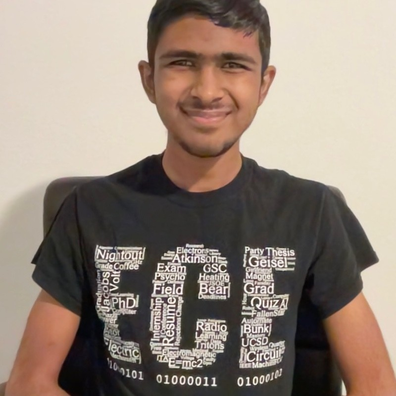

# CSE 15L Lab Reports
## Fall Quarter 2023, UC San Diego
---
Hello, my name is **Girish Krishnan**. I currently double major in *Electrical Engineering* (with a depth in Machine Learning and Controls) and *Computational Physics*.

> Welcome to my CSE 15L lab reports website!

Here are some links to my socials!
* [Portfolio Website](https://girish-krishnan.github.io/)
* [LinkedIn](https://www.linkedin.com/in/girk/)

Here are some of my favorite classes at UC San Diego:
1. PHYS 141 - Computational Physics Project Class
2. ECE 285 - Deep Learning for Computer Vision
3. ECE 140B - The Art of Product Engineering II

