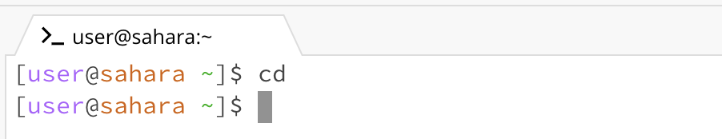
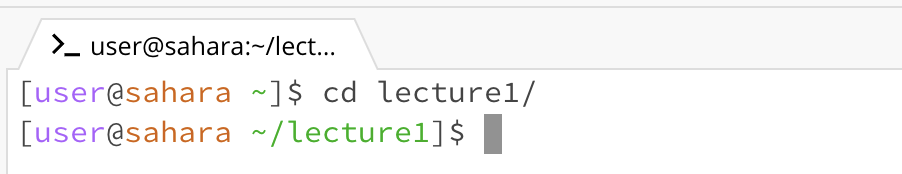
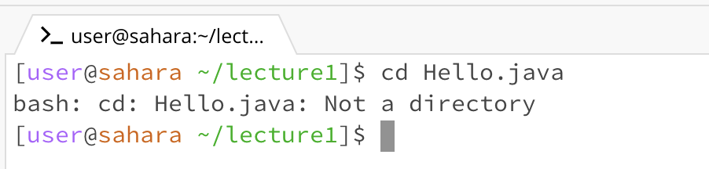
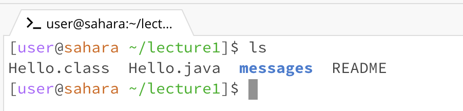
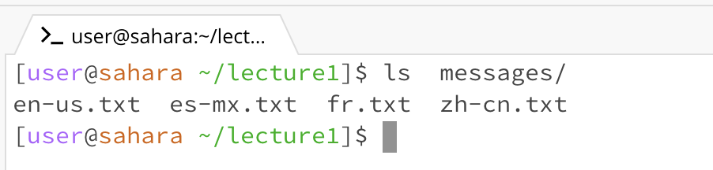
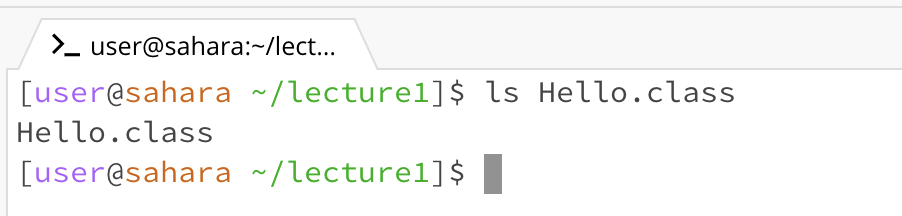
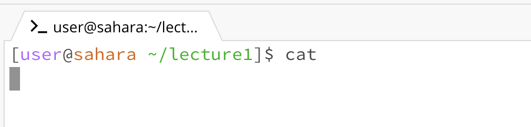
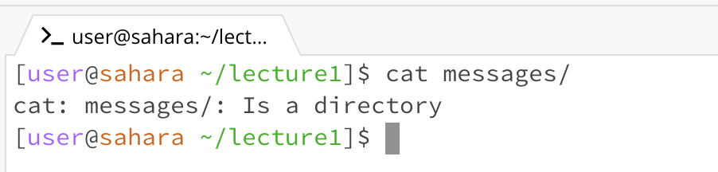
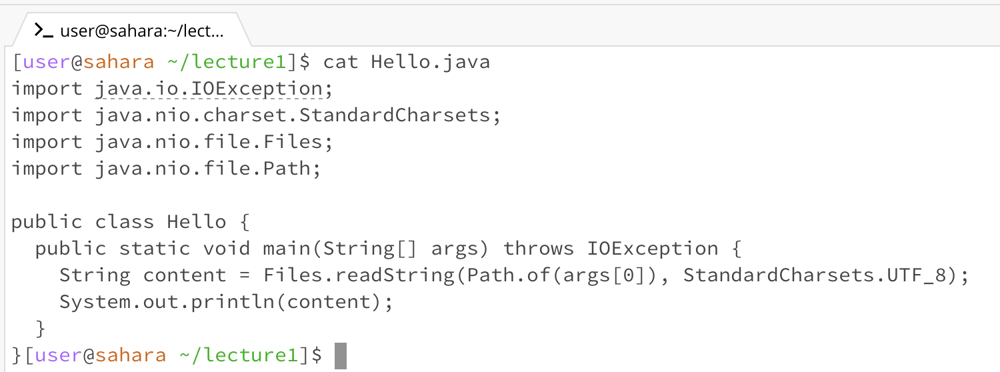

# Lab 1
## CSE 15L Fall 2023

This lab report covers basic filesystem commands.

### Intro to Basic Filesystem Commands
Here are some basic filesystem commands, along with their usage and explanation:

|Command|Explanation|
|---|---|
|`pwd`|Outputs the present working directory|
|`cd directory_name`|Changes the directory to the directory whose path is specified by directory_name|
|`ls`|Displays the names of the files and folders present in the current working directory|
|`cat`|Reads data from a file and gives its content as the output (displayed in the terminal)|

### Using the commands `cd`, `ls`, and `cat`

|Command|Code block showing command and output|Working directory from where the command was run|Why I got that output|Is the output an error?|
|---|---|---|---|---|
|`cd`||`/home`|Since no input argument is passed, the directory is unchanged.|No, it's not an error.|
|`cd ./lecture1`||`/home`|The command caused the directory to change from the current directory `/home/` to a new directory `/home/lecture1`.|No, it's not an error.|
|`cd ./Hello.java`||`/home/lecture1`|We get an error because the `cd` command is used to change directory. Hence, it does not make sense to pass in a file name since we must pass in the name of a directory.|Yes, it is an error, because the input argument for `cd` must be a path to a directory, not a file.|
|`ls`||`/home/lecture1`|The `ls` command is used to list the files and subdirectories present within the current directory. Thus, the output shows the contents of the `/home/lecture1` directory.|No, it's not an error|
|`ls ./messages`||`/home/lecture1`|This lists all the files and subdirectories within the `./messages` directory. This command can help us look inside different directories without having to change directory. |No, it's not an error.|
|`ls ./Hello.class`||`/home/lecture1`|The output is just the name of the file. Note that the file needs to exist for this to work. Also, the `ls` command can be used with additional options to display further information about that file. |No, it's not an error.|
|`cat`||`/home/lecture1`|Since no file input is specified, the `cat` command just reads input from the command line, i.e. it reads what the user types into the terminal. Thus, you can type in any text and press the ENTER (or RETURN) key and your input will be printed again in the terminal.|No, it's not an error.|
|`cat ./messages`||`/home/lecture1`|An error message appears here, as the input argument given was a directory, rather than a file. |Yes, it is an error because it does not make sense to `cat` a directory. The `cat` command should be used to read data from a file (not directory) and output the contents.|
|`cat ./Hello.java`||`/home/lecture1`|The `cat` command displays the contents of the `Hello.java` file by printing them into the terminal, as expected.|No, it's not an error.|

### Use of Generative AI
Generative AI was **not** used anywhere in this assignment.
