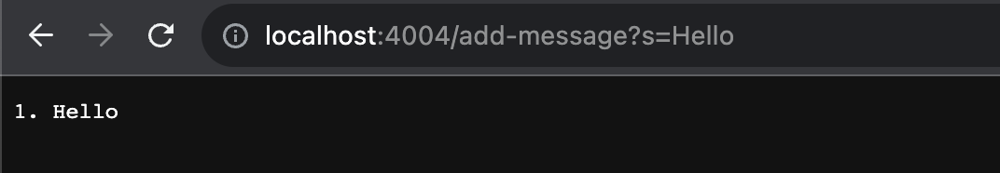
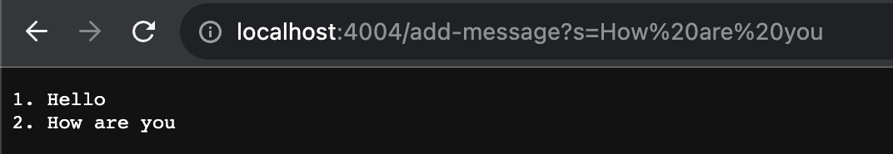
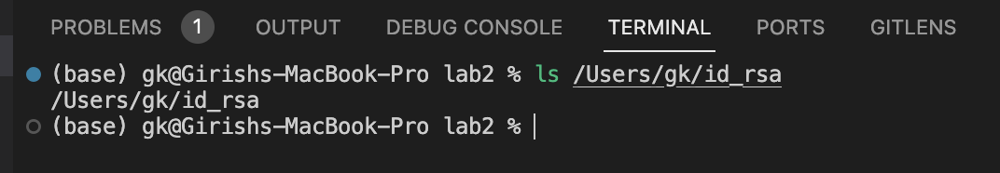
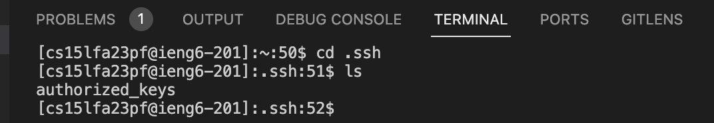
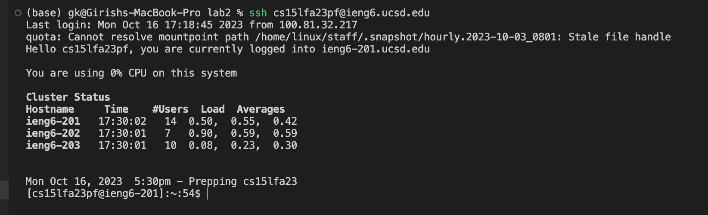

# Part 1: Implementing `StringServer`

### Code for `StringServer.java`:

```java
import java.io.IOException;
import java.net.URI;

class Handler implements URLHandler {
    // The string held by the server
    // As new add requests come in, we keep appending to the string
    String state = "";
    int currentIdx = 0;

    public String handleRequest(URI url) {
        if (url.getPath().equals("/")) {
            return state;
        } 
        else {
            if (url.getPath().contains("/add-message")) {
                String[] parameters = url.getQuery().split("=");
                if (parameters[0].equals("s")) {
                    currentIdx++;
                    if (currentIdx != 1)
                        state += "\n" + currentIdx + ". " + parameters[1];
                    else
                        state += currentIdx + ". " + parameters[1];
                    return state;
                }
            }
            return "404 Not Found!";
        }
    }
}

class StringServer {
    public static void main(String[] args) throws IOException {
        if(args.length == 0){
            System.out.println("Missing port number! Try any number between 1024 to 49151");
            return;
        }

        int port = Integer.parseInt(args[0]);

        Server.start(port, new Handler());
    }
}
```

Here is the code for `Server.java`:

```java
// A simple web server using Java's built-in HttpServer

// Examples from https://dzone.com/articles/simple-http-server-in-java were useful references

import java.io.IOException;
import java.io.OutputStream;
import java.net.InetSocketAddress;
import java.net.URI;

import com.sun.net.httpserver.HttpExchange;
import com.sun.net.httpserver.HttpHandler;
import com.sun.net.httpserver.HttpServer;

interface URLHandler {
    String handleRequest(URI url);
}

class ServerHttpHandler implements HttpHandler {
    URLHandler handler;
    ServerHttpHandler(URLHandler handler) {
      this.handler = handler;
    }
    public void handle(final HttpExchange exchange) throws IOException {
        // form return body after being handled by program
        try {
            String ret = handler.handleRequest(exchange.getRequestURI());
            // form the return string and write it on the browser
            exchange.sendResponseHeaders(200, ret.getBytes().length);
            OutputStream os = exchange.getResponseBody();
            os.write(ret.getBytes());
            os.close();
        } catch(Exception e) {
            String response = e.toString();
            exchange.sendResponseHeaders(500, response.getBytes().length);
            OutputStream os = exchange.getResponseBody();
            os.write(response.getBytes());
            os.close();
        }
    }
}

public class Server {
    public static void start(int port, URLHandler handler) throws IOException {
        HttpServer server = HttpServer.create(new InetSocketAddress(port), 0);

        //create request entrypoint
        server.createContext("/", new ServerHttpHandler(handler));

        //start the server
        server.start();
        System.out.println("Server Started!");
    }
}

```

To compile the code, run:

```
javac Server.java StringServer.java
```

To run the code, run:

```
java StringServer PORT_NUMBER
```

where PORT_NUMBER is the port number you want to run the server on.

### Screenshots of using add-message

##### Screenshot 1: Adding "Hello"



**Which methods in your code are called?**

When making a request on the route `/add-message?s=Hello`, the `handleRequest` method in `Handler` is called. This in turn calls the `getPath()` method in the `URI` class which retrieves the path of the URI. Another method that gets called is the `getQuery()` method from the `URI` class, which helps retrieve the query (so that it can be parsed later on and added to the string).

**What are the relevant arguments to those methods, and the values of any relevant fields of the class?**

The argument to the `handleRequest` method is the `URI` object `url`. The `URI` object `url` contains the path and query of the URI, which is used to retrieve the path and query.

The `getPath()` and `getQuery()` methods do not take in any input arguments, but they return the path and query of the URI respectively (as they are called from the `URI` object).

In this specific example, the argument to the `handleRequest` method is the full URI `http://localhost:PORT_NUMBER/add-message?s=Hello`. The `getPath()` method returns `"/add-message"` and the `getQuery()` method returns `"s=Hello"`. This is parsed later on to retrieve the message `"Hello"`.

The values of the fields of the `Handler` class are `state = ""` and `currentIdx = 0` before the request is made. The `state` field is the string held by the server, and the `currentIdx` field is the current index of the message. After making the request, the `state` field changes to `"1. Hello"` and the `currentIdx` field changes to `1`. 

Note that `currentIdx` is incremented before the string is appended with the index and message, so that the indices correctly start at 1.

**How do the values of any relevant fields of the class change from this specific request? If no values got changed, explain why.**

The `state` and `currentIdx` fields of the `Handler` class change from this specific request. The `state` field changes because the string is appended with the new message. Thus, the `state` field changes from an empty strin `""` to `"1. Hello"`.

The `currentIdx` field changes because it is incremented by 1 to keep track of the number of messages. In this specific request, the `currentIdx` field changes from `0` to `1`, before the string is appended with the index and message.

##### Screenshot 2: Adding "How are you"



**Which methods in your code are called?**

Just as before, the `handleRequest` method in `Handler` is called. This in turn calls the `getPath()` method in the `URI` class which retrieves the path of the URI. Another method that gets called is the `getQuery()` method from the `URI` class, which helps retrieve the query (so that it can be parsed later on and added to the string).

**What are the relevant arguments to those methods, and the values of any relevant fields of the class?**

The arguments to the `handleRequest` method are the `URI` object `url`. The `URI` object `url` contains the path and query of the URI, which is used to retrieve the path and query.

The `getPath()` and `getQuery()` methods do not take in any input arguments, but they return the path and query of the URI respectively (as they are called from the `URI` object).

In this specific example, the argument to the `handleRequest` method is the full URI `http://localhost:PORT_NUMBER/add-message?s=How%20are%20you`. The `getPath()` method returns `"/add-message"` and the `getQuery()` method returns `"s=How%20are%20you"`. This is parsed later on to retrieve the message `"How are you"`.

The values of the fields of the `Handler` class are `state = "1. Hello"` and `currentIdx = 1` before the request is made. The `state` field is the string held by the server, and the `currentIdx` field is the current index of the message. After making the request, the `state` field changes to `"1. Hello\n2. How are you"` and the `currentIdx` field changes to `2`.

**How do the values of any relevant fields of the class change from this specific request? If no values got changed, explain why.**

The `state` and `currentIdx` fields of the `Handler` class change from this specific request. The `state` field changes because the string is appended with the new message. Thus, the `state` field changes from `"1. Hello"` to `"1. Hello\n2. How are you"`.

The `currentIdx` field changes because it is incremented by 1 to keep track of the number of messages. In this specific request, the `currentIdx` field changes from `1` to `2`, before the string is appended with the index and message.


# Part 2: Using the commandline with `ls`

The path to the private key for your SSH key for logging into `ieng6` (on your computer or on the home directory of the lab computer)



The path to the public key for your SSH key for logging into `ieng6` (within your account on `ieng6`)

Within my `ieng6` account, the public key is stored in `authorized_keys` in the `.ssh` folder.



A terminal interaction where you log into `ieng6` with your course-specific account without being asked for a password.



# Part 3: Something I learned from lab in Week 2 or 3

**Setting up SSH keys**

I learned how to set up SSH keys, to make the process of SSHing more efficient. I learned how to generate SSH keys, and how to add them to the `authorized_keys` file on `ieng6`. This allows me to SSH into `ieng6` without having to enter my password every time.

**Using the SCP command**

This allows you to efficiently transfer over files from your local machine to `ieng6` in a single terminal command.

**Building and running web servers using Java**

I learned how to build simple webservers using Java and host them locally. This involved using the `URIHandler` class along with a method to handle requests.

**Using the `curl` command**

This provides a quick way to access URLs without having to open them up in the browser. This could help in testing out web servers with different requests.