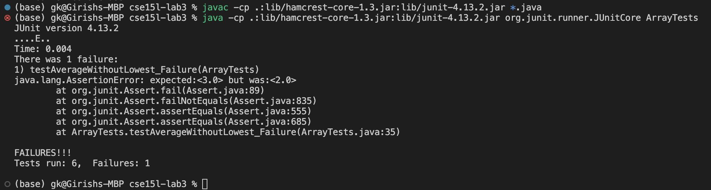

# Lab 3
## CSE 15L Fall 2023
**Girish Krishnan**

### Part 1: Bugs

The chosen bug: the bug in the`averageWithoutLowest` function in `ArrayExamples.java`.

#### A failure-inducing input for the buggy program, as a JUnit test and any associated code

A failure-inducing input is the array `{1.0, 1.0, 3.0, 3.0}`. This input causes the function to return 2.0, when it should return 3.0. This is because the function is not counting the number of times the lowest number appears in the array, and is instead just subtracting 1 from the length of the array. This is incorrect because the lowest number appears twice in the array, so the length of the array should be subtracted by 2, not 1.

```java
import static org.junit.Assert.*;
import org.junit.*;

public class ArrayTests {
  @Test
  public void testAverageWithoutLowest_Failure () {
    double[] input1 = {1.0, 1.0, 3.0, 3.0};
    assertEquals(3.0, ArrayExamples.averageWithoutLowest(input1), 0.0001);
  }
}
```

Here is the original code for `averageWithoutLowest`, for reference:


```java
static double averageWithoutLowest(double[] arr) {
    if(arr.length < 2) { return 0.0; }
    double lowest = arr[0];
    for(double num: arr) {
      if(num < lowest) { lowest = num; }
    }
    double sum = 0;
    for(double num: arr) {
      if(num != lowest) { sum += num; }
    }
    return sum / (arr.length - 1);
  }
```

This code should be placed in `ArrayTests.java`. Here is the commands to run the JUnit test (using MacOS):

```bash
javac -cp .:lib/hamcrest-core-1.3.jar:lib/junit-4.13.2.jar *.java

java -cp .:lib/hamcrest-core-1.3.jar:lib/junit-4.13.2.jar org.junit.runner.JUnitCore ArrayTests
```

#### An input that doesn't induce a failure, as a JUnit test and any associated code

```java
import static org.junit.Assert.*;
import org.junit.*;

public class ArrayTests {
  @Test
  public void testAverageWithoutLowest_NoFailure () {
    double[] input1 = {1.0, 2.0, 3.0};
    assertEquals(2.5, ArrayExamples.averageWithoutLowest(input1), 0.0001);
  }
}
```

For this input, the function returns the correct value of 2.5. This is because the lowest number in the array is 1.0 and the lowest number only appears once in the array.

This JUnit test code should be placed in `ArrayTests.java`. Here is the commands to run the JUnit test (using MacOS):

```bash
javac -cp .:lib/hamcrest-core-1.3.jar:lib/junit-4.13.2.jar *.java

java -cp .:lib/hamcrest-core-1.3.jar:lib/junit-4.13.2.jar org.junit.runner.JUnitCore ArrayTests
```

#### The symptom, as the output of running the tests

Here is the screenshot of running the JUnit tests with the two inputs above:



The failed test is clearly shown above, for the test `testAverageWithoutLowest_Failure`, where the expected value is 3.0, but the actual value is 2.0. Note that all the other tests passed. The 4 other tests apart from `testAverageWithoutLowest_Failure` and `testAverageWithoutLowest_NoFailure` are tests for the other methods in `ArrayExamples.java`.

#### The bug, as the before-and-after code change required to fix it

**Before**
```java
static double averageWithoutLowest(double[] arr) {
    if(arr.length < 2) { return 0.0; }
    double lowest = arr[0];
    for(double num: arr) {
      if(num < lowest) { lowest = num; }
    }
    double sum = 0;
    for(double num: arr) {
      if(num != lowest) { sum += num; }
    }
    return sum / (arr.length - 1);
  }
```

**After**

```java
static double averageWithoutLowest(double[] arr) {
    if(arr.length < 2) { return 0.0; }
    int lowestCount = 0;
    double lowest = arr[0];
    for(double num: arr) {
      if(num < lowest) { lowest = num; }
    }
    double sum = 0;
    for(double num: arr) {
      if(num != lowest) { sum += num; }
      else {lowestCount+=1;}
    }
    return sum / (arr.length - lowestCount);
  }
  ```

**Explanation for why this addresses the issue**: The bug was that the function was not counting the number of times the lowest number appears in the array, and is instead just subtracting 1 from the length of the array. This is incorrect because the lowest number could potentially appear more than once in the array, so the length of the array should be subtracted by the number of times the lowest number appears in the array. The fix was to add a counter variable `lowestCount` that counts the number of times the lowest number appears in the array. Then, the length of the array is subtracted by `lowestCount` instead of 1.


### Part 2: Researching Commands

Chosen command: `grep`, a command-line utility to search text using patterns.

Here are 4 interesting command-line options:

#### `-v` or `--invert-match`

This option inverts the sense of matching, to select non-matching lines. For example, if you want to find all the lines in a file that do not contain the word "hello", you can use `grep -v "hello" file.txt`.

**Two Examples of Using it**

*Example 1: Counting the number of lines in a file that do not contain a certain word* 
```bash
grep -vc "gene" ./technical/biomed/ar104.txt
```
Output:

```bash
619
```

This command finds all the lines in the file `ar104.txt` that do not contain the word "gene", and prints the number of lines that do not contain the word "gene". The `-c` option prints only a count of the matching lines. The `-v` option inverts the sense of matching, to select non-matching lines. This is useful because it allows you to find all the lines in a file that do not contain a certain word or phrase.

*Example 2: Removing all lines containing a certain word from a file*
```bash
grep -v "gene" ./technical/biomed/ar104.txt > ./technical/biomed/ar104_no_gene.txt
```

Output: We can check that the word count of "gene" in the original file is 619, and the word count in the new file is 0.

```bash
grep -c "gene" ./technical/biomed/ar104_no_gene.txt

# Will return 0
```

**Source:** The `man` command in the terminal was used to find this option. The `man` command is used to display the manual page for a command. For example, `man grep` displays the manual page for the `grep` command. The manual page for `grep` can also be found [here](https://www.gnu.org/software/grep/manual/grep.html).


#### `-o` or `--only-matching`

This option prints only the matching part of the lines. For example, if you want to find all the lines in a file that contain the word "hello", but you only want to print the word "hello" and not the entire line, you can use `grep -o "hello" file.txt`.

**Two Examples of Using it**

*Example 1: Finding all the words in a file that contain a certain word*
```bash
grep -o "genetic" ./technical/biomed/ar104.txt
```

Output:

```bash
genetic
```

It turns out there was only one instance of the word "genetic" in the file `ar104.txt`. This command finds all the lines in the file `ar104.txt` that contain the word "genetic", and prints only the word "genetic" from each line. The `-o` option prints only the matching part of the lines. This is useful because it allows you to find all the words in a file that contain a certain word or phrase.

*Example 2: Showing the line containing a certain word*
```bash
grep -o "gene.*" ./technical/biomed/ar104.txt
```

Output:

```bash
genes directly to the synovial lining can theoretically
genes have been effective in treating
gene
gene for murine IL-4
generated. The ability of Ad-mIL-4 to
gene
gene
gene transfer of IL-4 to treat established and
gene transfer of IL-4 reduced
gene transfer of IL-10 and IL-1 and TNF inhibitors
gene therapy
genes directly to the synovial lining can theoretically
genes such as those
genes have been
gene transfer has
gene transfer.
generated an
gene for murine IL-4
gene
generation
generated by
generalized inflammation;
generation and/or
gene transfer in a murine model of arthritis, increasing
gene transfer to joints with established disease
gene that encodes
gene delivery
gene expression,
gene expression was detectable for up to 5 weeks
gene
gene
gene transfer of v-IL-10,
gene transfer of IL-4 to treat established
gene transfer of Ad-mIL-4 reduced
gene transfer of IL-10
genes, whereas
genes for these
gene transfer of IL-4
gene transfer resulted in the inhibition of CIA in
gene transfer of v-IL-10
gene transfer of v-IL-10 to untreated
genetically modified to express IL-4, is able to
gene therapy for the clinical treatment of RA.
```

This command finds all the lines in the file `ar104.txt` that contain the word "gene", starting from the word "gene" to the end of the line, and prints only the matching part of the lines. The `-o` option prints only the matching part of the lines. This is useful because it allows you to show the line containing a certain word or phrase and allows you to see the context of the word or phrase.

**Source:** The `man` command in the terminal was used to find this option. The `man` command is used to display the manual page for a command. For example, `man grep` displays the manual page for the `grep` command. The manual page for `grep` can also be found [here](https://www.gnu.org/software/grep/manual/grep.html).

#### `-c` or `--count`

This option prints only a count of the matching lines. For example, if you want to find all the lines in a file that contain the word "hello", but you only want to print the number of lines that contain the word "hello", you can use `grep -c "hello" file.txt`.

**Two Examples of Using it**

*Example 1: Counting the number of lines in a file that contain a certain word* 
```bash
grep -c "gene" ./technical/biomed/ar104.txt
```
Output:

```bash
43
```

This command finds all the lines in the file `ar104.txt` that contain the word "gene", and prints the number of lines that contain the word "gene". The `-c` option prints only a count of the matching lines. 

*Example 2: Using grep -c to count the number of lines in a file*
```bash
grep -c "" ./technical/biomed/ar104.txt
```

Output:

```bash
662
```

This command finds all the lines in the file `ar104.txt` that contain the empty string, and prints the number of lines that contain the empty string, which is essentially the number of lines in the file.

**Source:** The `man` command in the terminal was used to find this option. The `man` command is used to display the manual page for a command. For example, `man grep` displays the manual page for the `grep` command. The manual page for `grep` can also be found [here](https://www.gnu.org/software/grep/manual/grep.html).

#### `--color=auto` or `--color=always`

This option highlights the matching text in color. For example, if you want to find all the lines in a file that contain the word "hello", and you want to highlight the word "hello" in red, you can use `grep --color=auto "hello" file.txt`. The `--color=auto` option highlights the matching text in color only if the output is to a terminal. The `--color=always` option always highlights the matching text in color, even if the output is not to a terminal.

**Two Examples of Using it**

*Example 1: Highlighting the matching text in color*
```bash
grep --color=auto "gene" ./technical/biomed/ar104.txt
```

Output:


This command finds all the lines in the file `ar104.txt` that contain the word "gene", and highlights the word "gene" in color.

*Example 2: Highlighting the entire line in color*

This highlights the text starting from "gene" until the end of the line.

```bash
grep --color=always "gene.*" ./technical/biomed/ar104.txt
```

Output:


This command finds all the lines in the file `ar104.txt` that contain the word "gene", starting from the word "gene" to the end of the line, and highlights the entire line in color.

**Source:** The `man` command in the terminal was used to find this option. The `man` command is used to display the manual page for a command. For example, `man grep` displays the manual page for the `grep` command. The manual page for `grep` can also be found [here](https://www.gnu.org/software/grep/manual/grep.html).