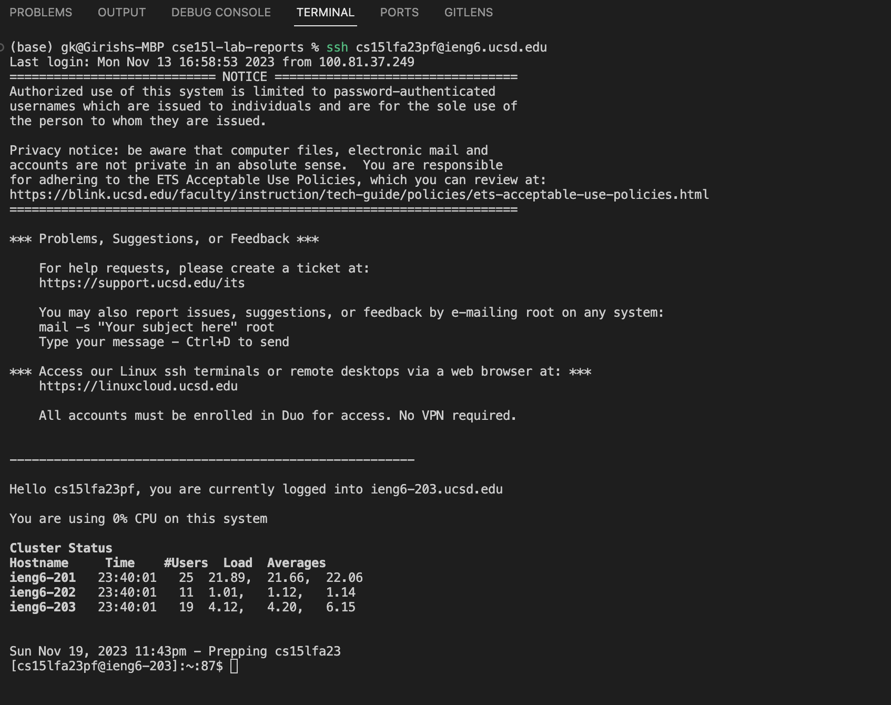
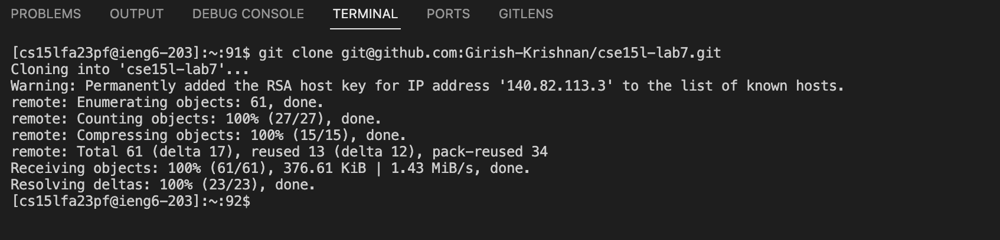
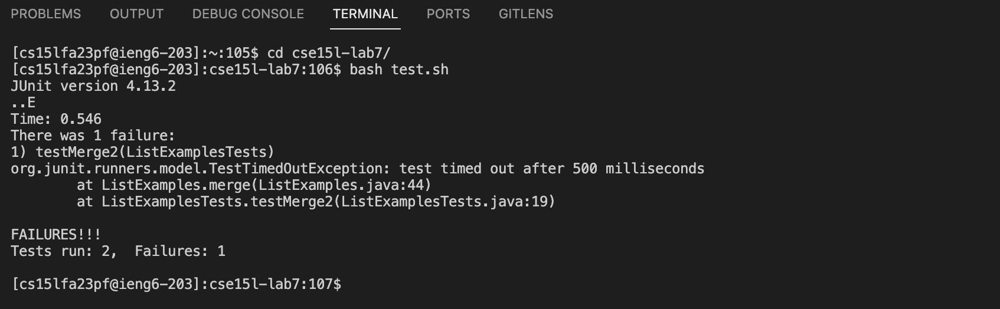
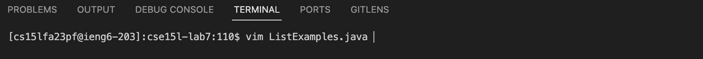
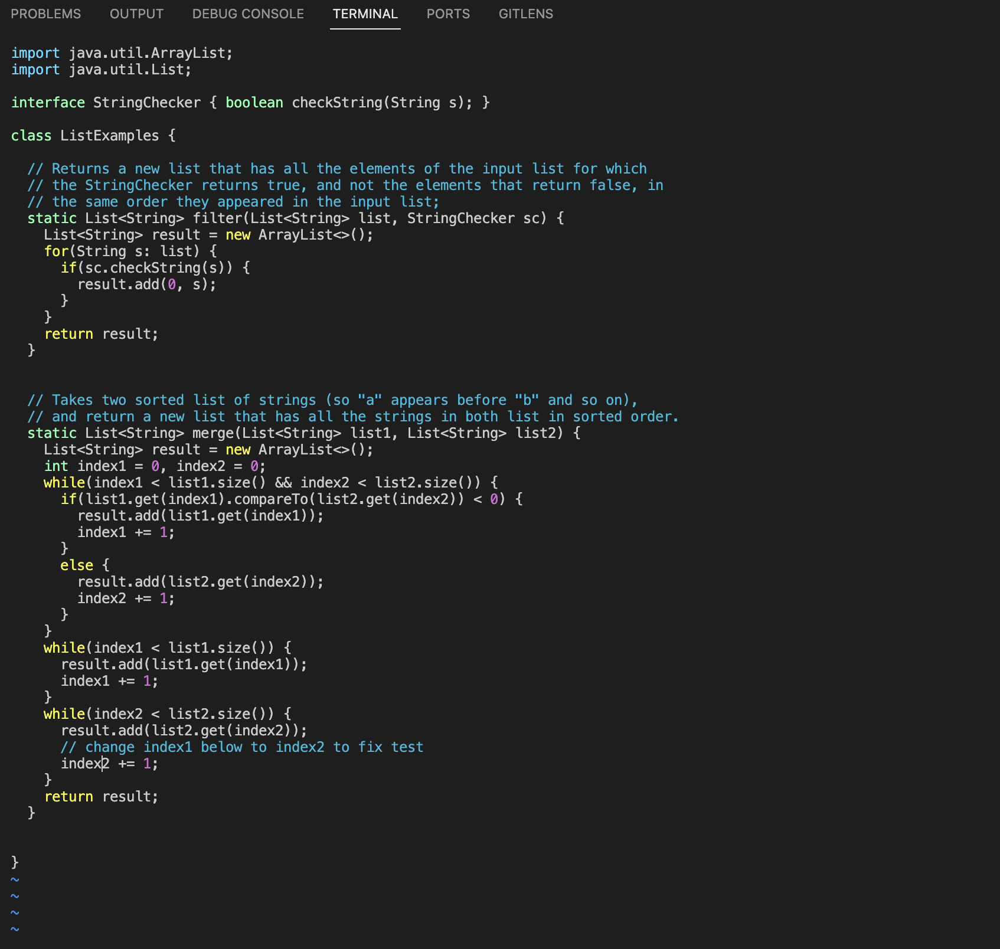
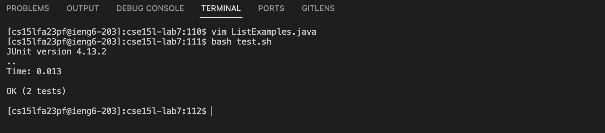
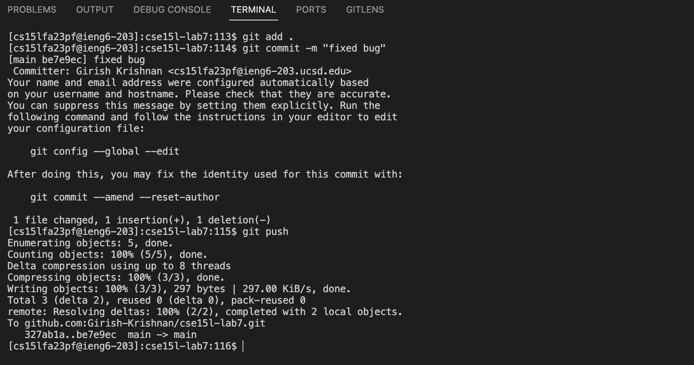

# Lab 4 Report

In this lab report, I will reproduce the steps taken in Week 7 (where we timed ourselves using Vim) and give detailed explanations and screenshots for steps 4-9.

## Step 4: Log into ieng6

**Screenshot:**



**Keys pressed to get to this step:**

Since I already typed in the `ssh` command to log in earlier (see screenshot above for full command: `ssh cs15lfa23pf@ieng6.ucsd.edu`), I just pressed the `<up>` arrow key and `<enter>` to re-enter that command.

Thus, the keys pressed to get to this step were: `<up><enter>`

**Summarize commands and what the effect of those keypresses were:**

The command is `ssh cs15lfa23pf@ieng6.ucsd.edu`. This command logs me into the ieng6 server using my username and the server's address. Since I have an SSH key set up with Github, I did not need to enter my password.

Effect of keypresses:

* `<up>` arrow key --> goes to previous command in the history
* `<enter>` key --> executes the command that is currently in the terminal

## Step 5: Clone your fork of the repository from your Github account (using the SSH URL)

**Screenshot:**



**Keys pressed to get to this step:**

I just pressed the `<up>` arrow key 8 times and `<enter>` to re-enter the `git clone` command that I had entered earlier (see screenshot above for full command). The reason I pressed the `<up>` arrow key 8 times is because I had to go back 8 commands in the history to get to the `git clone` command.

Thus, the keys pressed to get to this step were: `<up><up><up><up><up><up><up><up><enter>`

Alternatively, I could have just typed in the `git clone` command again, and copied and pasted the SSH URL from my Github account:

```
git clone git@github.com:Girish-Krishnan/cse15l-lab7.git
```

This would involve typing:

```
git<space>clone<space><Ctrl-V>
```
where `<Ctrl-V>` is the keyboard shortcut for pasting the contents of the clipboard (in this case, github SSH URL).

**Summarize commands ran and what the effect of those keypresses were:**

The command is `git clone git@github.com:Girish-Krishnan/cse15l-lab7.git`. This command clones the repository from my Github account to the ieng6 server. Since I have an SSH key set up with Github, I did not need to enter my password. Also, I had already forked the repository previously.

The effects of those keypresses are:

* `<up>` arrow key (8 times) --> goes to previous command in history (8 commands ago)
* `<enter>` key --> executes command

## Step 6: Run the tests, demonstrating that they fail

**Screenshot:**



**Keys pressed to get to this step:**

I pressed `cd` (followed by a space) and then the `<tab>` key to autocomplete the directory name. Then I pressed `<enter>` to execute the command. Then, I typed `bash` (followed by a space) and pressed `t` (since `test.sh` starts with a t) and then `<tab>` to autocomplete the file name. Then I pressed `<enter>` to execute the command.

Thus, the keys pressed to get to this step were: `cd<space><tab><enter>bash<space>t<tab><enter>`

Note that I could have just typed in the commands again, but I chose to use the `<tab>` key to autocomplete the directory and file names. Also, this process worked because there was only one directory in the current directory (and hence `cs15l-lab7` was autocompleted) and only one file starting with `t` (and hence `test.sh` was autocompleted).

**Summarize commands and what the effect of those keypresses were:**

The commands were:
* `cd cse15l-lab7` --> changes directory to `cse15l-lab7`
* `bash test.sh` --> runs the tests in the bash script `test.sh`

The effects of those keypresses are:
* `<space>` --> adds a space to the command, allowing you to type in the directory name to `cd` into
* `<tab>` --> autocompletes the directory name (in this case, `cse15l-lab7`). This helps work much faster since you don't have to type in the entire directory name.
* `<enter>` --> executes the command
* When typing in `bash t<tab>`, this indicates that the script to be run starts with a `t`. Since there is only one file starting with a `t`, the file name is autocompleted to `test.sh`. And then `<enter>` is pressed to execute the command.

## Step 7: Edit the code file to fix the failing test

**Screenshots:**

Part 1: Writing the command to open the code file in Vim:



Part 2: Editing the code file in Vim to change `index1` to `index2` at the bottom (at the last instance of `index1`):



**Keys pressed to get to this step:**

I typed `vim` (followed by a space) and then `L` and then pressed `<tab>` to partially autocomplete the file name: `ListExamples.`, although I had to type in `j` and then `<tab>` to fully autocomplete the file name: `ListExamples.java`. This is because there is `ListExamples.java` and `ListExamples.class`. Then I pressed `<enter>` to execute the command.

Thus, the keys pressed are: `vim<space>L<tab>j<tab><enter>`

Now, after the file is opened in Vim, I pressed `?i<enter>` to search for the last instance of `index1`. Then, I pressed `e` to go to the end of the word `index1`. Then, I pressed `r2` to replace the character `1` with `2`. Then, I pressed `:wq` to save and quit the file.

Thus, the keys pressed are: `?i<enter>er2:wq<enter>`

The entire sequence of keys pressed to get to this step is: `vim<space>L<tab>j<tab><enter>?i<enter>er2:wq<enter>`

**Summarize commands and what the effect of those keypresses were:**

The command executed is `vim ListExamples.java`. This opens the file `ListExamples.java` in Vim. The key presses are `vim<space>L<tab>j<tab><enter>`

The effects of those keypresses are:

* `vim` types in the command to open the file in Vim
* `<space>` adds a space to the command, allowing you to type in the file name to open in Vim
* `L` types in the first letter of the file name
* `<tab>` autocompletes the file name to `ListExamples.`
* `j` types in the letter `j` so that we can indicate that we want to open the file `ListExamples.java` instead of `ListExamples.class`
* `<tab>` autocompletes the file name to `ListExamples.java`
* `<enter>` executes the command

Now, when the file is opened in Vim, the key presses are `?i<enter>er2:wq<enter>`

The effects of those keypresses are:

* `?i` searches for the last instance of the word `index1`
* `<enter>` executes the search
* `e` goes to the end of the word `index1`
* `r2` replaces the character `1` with `2`
* `:wq` saves and quits the file
* `<enter>` executes the command to save and quit the file

## Step 8: Run the tests, demonstrating that they now succeed

**Screenshot:**



**Keys pressed to get to this step:**

I just pressed `<up>` two times and `<enter>` to re-enter the `bash test.sh` command that I had entered earlier (see screenshot above for full command). The reason I pressed the `<up>` arrow key two times is because I had to go back two commands in the history to get to the `bash test.sh` command, since the previous command was `vim ListExamples.java` and the command before that was `bash test.sh`.

**Summarize commands and what the effect of those keypresses were:**

The command is `bash test.sh`. This command runs the tests in the bash script `test.sh`, just as it did in Step 6. The effects of those keypresses are:

* `<up>` arrow key (2 times) --> goes to previous command in history (2 commands ago)
* `<enter>` key --> executes command

## Step 9: Commit and push the resulting change to your Github account (you can pick any commit message!)

**Screenshot:**



**Keys pressed to get to this step:**

The keys pressed to get to this step were:

* `git<space>add<space><period><enter>` --> adds all files to the staging area. There was only one modified file, but this makes the process faster since you don't have to type in the file name.
* `git<space>commit<space>-m<space>"<message>"<enter>` --> commits the changes with the commit message `<message>`. I chose the commit message `Fixed failing test` for this step.
* `git<space>push<enter>` --> pushes the changes to the remote repository (Github). By default, the changes will be pushed to the `master` branch. Also, I didn't have to type in the username and password since I have an SSH key set up with Github.

Thus, the comprehensive list of key strokes are:    
 ```
    git<space>add<space><period><enter>
    git<space>commit<space>-m<space>"Fixed failing test"<enter>
    git<space>push<enter>
```

**Summarize commands and what the effect of those keypresses were:**

The commands are:
* `git add .` --> adds all files to the staging area (there was only one modified file, but this makes the process faster since you don't have to type in the file name)
* `git commit -m "Fixed failing test"` --> commits the changes with the commit message `Fixed failing test`
* `git push` --> pushes the changes to the remote repository (Github). By default, the changes will be pushed to the `master` branch. You can also specify `git push origin master` to push the changes to the `master` branch of the `origin` remote. But in this case, there was only one remote.

The effects of those keypresses are:

* `git` types in the command to add, commit, or push changes
* `<space>` adds a space to the command, allowing you to type in the file name to add, commit, or push changes
* `add` types in the command to add changes
* `.` indicates that all files should be added to the staging area
* `<enter>` executes the command
* `commit` types in the command to commit changes
* `-m` indicates that the commit message will be specified in the next argument
* `<space>` adds a space to the command, allowing you to type in the commit message
* `"` indicates that the commit message will be enclosed in quotes
* `Fixed failing test` is the commit message
* `"` indicates that the commit message will be enclosed in quotes
* `<enter>` executes the command
* `push` types in the command to push changes
* `<enter>` executes the command

### Use of Generative AI
Generative AI was **not** used anywhere in this assignment.

[Home Page](./index.html)