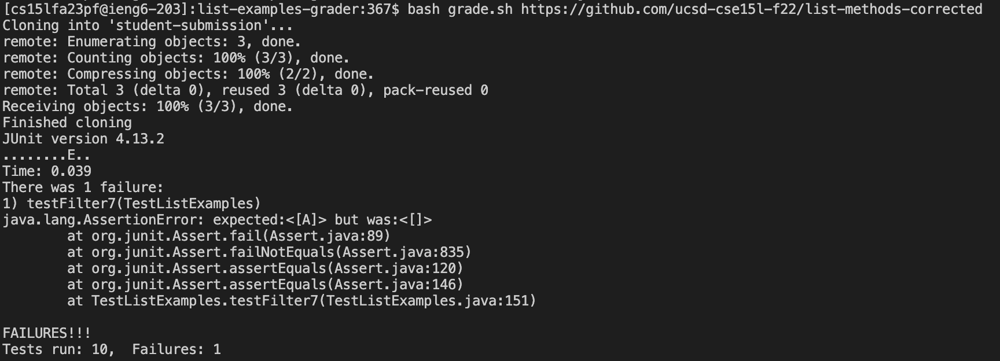
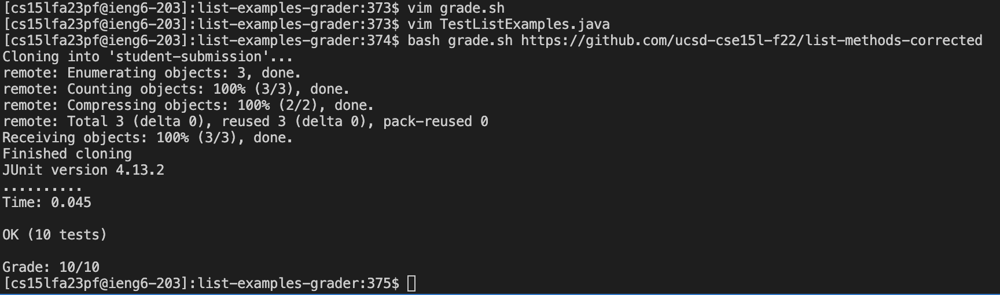

# Lab 5 Report

## Part 1 - Debugging Scenario

*Design a debugging scenario, and write your report as a conversation on EdStem.*

**Context**: This debugging scenario is from the `list-examples-grader` that we built in the Week 6 lab. This includes a java file called `TestListExamples.java` that runs JUnit tests on the students' submissions, and a bash script called `grade.sh` that handles the process of cloning the student's repository, running the tests, and printing out the grade for the PA (out of 10).

Now, let's go through the debugging scenario, where a student tries to implement `grade.sh` and `TestListExamples.java` but runs into a bug.

### The original post from a student with a screenshot showing a symptom and a description of a guess at the bug/some sense of what the failure-inducing input is. 

Hi!

I've been working on the Week 6 lab and I'm struggling to get my grading bash script and the java file to test the list examples to work correctly. I'm running the script on the ieng6 server, and I'm testing it on the `list-methods-corrected` repository (link: https://github.com/ucsd-cse15l-f22/list-methods-corrected). Now, I would expect that all my tests pass successfully for this repository (since the all the code in that repo looks correct), but it turns out that one of my tests doesn't seem to pass for a weird reason. I've attached a screenshot of the output of my script below, showing the **symptom**:



As you can see, the output of testFilter7 fails and indicates that the expected output is [A] but the actual output is []. This is weird because all the other tests work successfully and all my other tests are relatively similar to this one. I've tried to debug this by looking at the code in `TestListExamples.java` and I've tried to run the tests manually using `junit` but I can't seem to figure out what's wrong. I've also tried to look at the code in `grade.sh` but I can't seem to find anything wrong with it. Here is the code for the test that fails:

```java
@Test(timeout = 500)
public void testFilter7() {
  List<String> input = Arrays.asList("M", "A", "D", "C");
  List<String> filtered = ListExamples.filter(input, new StringChecker() {
    public boolean checkString(String s) {
      return s == new String("A");
    }
  });

  String expectedString = new String("A");
  List<String> expected = Arrays.asList(expectedString);
  assertEquals(expected, filtered);
}
```
My best **guess at the bug/some sense of what the failure-inducing input is** is that there's probably something wrong in the stringchecker itself. Perhaps there's something that prevents the stringchecker from checking if the string is equal to "A" correctly. However, I've made the stringchecker as simple as possible using a simple `==` statement and I've also tried to change the expectedString to a new String("A") but it still doesn't work. I'm not sure what else to try. Thus, the failure-inducting input here is the test case [M, A, D, C] and the stringchecker that checks if the string is equal to "A".

Apart from the error above, my bash script is supposed to print out the grade received by the student for the PA. In the example above, the resulting grade should be 9/10. However, we can see that this grade is never even printed out! I'm not sure why this is happening. I've attached the code for `grade.sh` below:

```bash
set -e # exit on error

CPATH='.:lib/hamcrest-core-1.3.jar:lib/junit-4.13.2.jar'

rm -rf student-submission
rm -rf grading-area

mkdir grading-area
cp -r lib ./grading-area
cp TestListExamples.java ./grading-area

git clone $1 student-submission
echo 'Finished cloning'


# Draw a picture/take notes on the directory structure that's set up after
# getting to this point

# Then, add here code to compile and run, and do any post-processing of the
# tests

# Check if student-submission/ListExamples.java exists
if [ ! -f student-submission/ListExamples.java ]; then
    echo "[ERROR] ListExamples.java not found in the root of the repository. Please make sure that the file is in the root of the repository and try again. Also, check that the file is named correctly."
    echo "Grade: 0 / 10"
    exit 1
fi

# Else, move it to the grading area and compile it
mv student-submission/ListExamples.java grading-area

# Try compiling ListExamples.java and store the result in a variable
# If the compilation fails, print an error message indicating what the compilation error was
# and exit with a non-zero exit code
javac -cp $CPATH grading-area/ListExamples.java
if [ $? -ne 0 ]; then
    echo "[ERROR] ListExamples.java failed to compile. Please make sure that the file compiles and try again. The error message is shown above."
    echo "Grade: 0 / 10"
    exit 1
fi

# Else, run the tests on ListExamples.class
cd grading-area

if [ ! -f ListExamples.class ]; then
    echo "[ERROR] ListExamples.class not found. The code did not compile successfully, so please see the error message above"
    echo "Grade: 0 / 10"
    exit 1
fi

javac -cp $CPATH TestListExamples.java
java -cp $CPATH org.junit.runner.JUnitCore TestListExamples 
java -cp $CPATH org.junit.runner.JUnitCore TestListExamples > test-results.txt

# Extract the last line to see how many tests fail
# If the number of tests that fail is greater than 0, print an error message
# If OK is found in the last line, print a success message

# Failures: X
failures=$(tail -n 2 test-results.txt | head -n 1 | grep -o '[0-9]*$')
tests=$(tail -n 2 test-results.txt | grep -oE '[0-9]+' | sed -n 1p)
echo "Grade: $((tests - failures))/$((tests))"
```

My best guess at the bug/some sense of what the failure-inducing input is is that there's probably something wrong with the line `java -cp $CPATH org.junit.runner.JUnitCore TestListExamples > test-results.txt`, because the test-results.txt file never even gets created. However, in the case where I comment out the test that was creating problems, the test-results.txt file gets created but even despite this the grade is not printed out. This could probably be due to a further bug in the line `failures=$(...)`.

Any help would be appreciated! Thanks!

### A response from a TA asking a leading question or suggesting a command to try (To be clear, you are mimicking a TA here.)

Hi!

Thanks for reaching out! 

I've looked at your code and I think I know what the problem is. I think the problem is that you're using `==` to compare strings in your stringchecker. This is not the correct way to compare strings in Java. Instead, you should use the `.equals()` method. This is because `==` compares the references of the two strings, whereas `.equals()` compares the actual values of the strings. Thus, you should change the line `return s == new String("A");` to `return s.equals(new String("A"));`. Also, if you don't want to consider the case of the string, you can use `return s.equalsIgnoreCase(new String("A"));` instead. 

In fact, the example test case that we showed in the lab uses `equalsIgnoreCase()`.

As for the other bug that you mentioned (from the bash script `grade.sh`), notice that you've included the command `set -e` at the very beginning of the bash script. Can you recall what this command does? (Hint: try removing this command to see what happens. Does it affect the way in which errors are handled?).

Note that the `set -e` command causes the script to exit immediately if any command fails. Thus, if any of the commands in the script fail, the script will exit immediately and the grade will not be printed out. Thus, when at least one of the JUnit tests fails, what happens is that the command `java -cp $CPATH org.junit.runner.JUnitCore TestListExamples` fails, and the script exits immediately and the `test-results.txt` file is not created.

Now, in the special case where you comment out the test that was creating problems, the `java -cp $CPATH org.junit.runner.JUnitCore TestListExamples` command does not fail, and the `test-results.txt` file is created. However, the `failures=$(...)` command fails because the `test-results.txt` file does not contain the line `Failures: X` (where X is the number of failures). Thus, the `failures=$(...)` command does not run successfully (causing the value of `failures` to be zero), and the grade is not printed out.

In summary, here are the things I would recommend you to look into:

1. Try to change the stringchecker to use `.equalsIgnoreCase()` instead of `==`. Also, you can just use `return s.equals("A");` instead of `return s.equals(new String("A"));` because `"A"` is already a string.
2. Try to remove the `set -e` command from the bash script, so that the rest of the script runs successfully even though no failures are found in the JUnit tests. Another thing you can do is to keep `set -e` at the beginning of the script (so that any other errors such as the GitHub repository not being found are handled correctly). And then, you can deactivate it using `set +e` before the line `java -cp $CPATH org.junit.runner.JUnitCore TestListExamples` so that the script does not exit immediately if the JUnit tests fail.

Please let me know if you have any other questions!

### Another screenshot/terminal output showing what information the student got from trying that, and a clear description of what the bug is.



**Clear description of bug:** There were two main bugs. One in `TestListExamples.java` and one in `grade.sh`.

*Bug in `TestListExamples.java`*

The bug in the stringchecker was that the student was using `==` to compare strings instead of `.equals()`. This is because `==` compares the references of the two strings, whereas `.equals()` compares the actual values of the strings. Thus, the student should have changed the line `return s == new String("A");` to `return s.equals(new String("A"));`. Also, if the student didn't want to consider the case of the string, they could have used `return s.equalsIgnoreCase(new String("A"));` instead. To make it even simpler, the student could have just used `return s.equals("A");` instead of `return s.equals(new String("A"));` because `"A"` is already a string. 

*Bug in `grade.sh`*

The bug in `grade.sh` was that the student forgot to deactivate `set -e` at the time when the JUnit tests are being run. This resulted in the script terminating even if one JUnit test failed. Thus, the student should have deactivated `set -e` before the line `java -cp $CPATH org.junit.runner.JUnitCore TestListExamples` so that the script does not exit immediately if the JUnit tests fail. This can be done using `set +e`. Then, the output of the tests can be written to a file called `test-results.txt` using `java -cp $CPATH org.junit.runner.JUnitCore TestListExamples > test-results.txt`. Then, the student can extract the number of failures from the `test-results.txt` file using `failures=$(tail -n 2 test-results.txt | head -n 1 | grep -o '[0-9]*$')`. Finally, the student can print out the grade using `echo "Grade: $((tests - failures))/$((tests))"`.

### At the end, all the information needed about the setup including:

#### The file & directory structure needed

The file and directory structure needed is as follows:

```
list-examples-grader
├── GradeServer.java
├── Server.java
├── TestListExamples.java
├── grade.sh
├── grading-area/
    ├── IsMoon.class
    ├── StringChecker.class
    ├── TestListExamples.class
    ├── TestListExamples.java
    ├── test-results.txt
    ├── lib/
        ├── hamcrest-core-1.3.jar
        ├── junit-4.13.2.jar
    ├── ListExamples.java
    ├── ListExamples.class
├── lib/
    ├── hamcrest-core-1.3.jar
    ├── junit-4.13.2.jar
├── student-submission
    ├── ListExamples.java
```

**Note:** the `student-submission` directory is variable and depends on the repository that is being tested. The `grading-area` directory is created by the `grade.sh` script.

#### The contents of each file before fixing the bug

Firstly, `Server.java` and `GradeServer.java` are the same as the ones in the Week 6 lab and are not used anywhere in this debugging scenario, so I will not include them here.

The contents of `TestListExamples.java` are as follows:

```java
import static org.junit.Assert.*;
import org.junit.*;
import java.util.Arrays;
import java.util.List;

class IsMoon implements StringChecker {
  public boolean checkString(String s) {
    return s.equalsIgnoreCase("moon");
  }
}

public class TestListExamples {
  @Test(timeout = 500)
  public void testMergeRightEnd() {
    List<String> left = Arrays.asList("a", "b", "c");
    List<String> right = Arrays.asList("a", "d");
    List<String> merged = ListExamples.merge(left, right);
    List<String> expected = Arrays.asList("a", "a", "b", "c", "d");
    assertEquals(expected, merged);
  }

  @Test(timeout = 500) 
  public void testMergeLeftEnd() {
    List<String> left = Arrays.asList("a", "d", "e");
    List<String> right = Arrays.asList("a", "a", "b");
    List<String> merged = ListExamples.merge(left, right);
    List<String> expected = Arrays.asList("a", "a", "a", "b", "d", "e");
    assertEquals(expected, merged);
  }

  @Test(timeout = 500)
  public void testFilter1() {
    List<String> input = Arrays.asList("Moon", "moon", "Sun", "sun");
    List<String> filtered = ListExamples.filter(input, new IsMoon());
    List<String> expected = Arrays.asList("Moon", "moon");
    assertEquals(expected, filtered);
  }

  @Test(timeout = 500)
  public void testFilter2() {
    List<String> input = Arrays.asList("Moon", "moon", "Sun", "sun");
    List<String> filtered = ListExamples.filter(input, new StringChecker() {
      public boolean checkString(String s) {
        return s.equalsIgnoreCase("sun");
      }
    });
    List<String> expected = Arrays.asList("Sun", "sun");
    assertEquals(expected, filtered);
  }

  // Add a test to test filter, but call filter twice in a row with two different inputs to see if both are correct
  @Test(timeout = 500)
  public void testFilter3() {
    List<String> input = Arrays.asList("Moon", "moon", "Sun", "sun");
    List<String> filtered = ListExamples.filter(input, new StringChecker() {
      public boolean checkString(String s) {
        return s.equalsIgnoreCase("sun");
      }
    });
    List<String> expected = Arrays.asList("Sun", "sun");
    
    List<String> input2 = Arrays.asList("Moon", "moon", "Sun", "sun");
    List<String> filtered2 = ListExamples.filter(input2, new StringChecker() {
      public boolean checkString(String s) {
        return s.equalsIgnoreCase("moon");
      }
    });
    List<String> expected2 = Arrays.asList("Moon", "moon");

    assertEquals(expected, filtered);
    assertEquals(expected2, filtered2);
  }

  // Test with empty list
  @Test(timeout = 500)
  public void testFilter4() {
    List<String> input = Arrays.asList();
    List<String> filtered = ListExamples.filter(input, new StringChecker() {
      public boolean checkString(String s) {
        return s.equalsIgnoreCase("sun");
      }
    });
    List<String> expected = Arrays.asList();
    assertEquals(expected, filtered);
  }

  // Test with empty list followed by non-empty list, and see that both are correct
  @Test(timeout = 500)
  public void testFilter5() {
    List<String> input = Arrays.asList();
    List<String> filtered = ListExamples.filter(input, new StringChecker() {
      public boolean checkString(String s) {
        return s.equalsIgnoreCase("sun");
      }
    });
    List<String> expected = Arrays.asList();

    List<String> input2 = Arrays.asList("Moon", "moon", "Sun", "sun");
    List<String> filtered2 = ListExamples.filter(input2, new StringChecker() {
      public boolean checkString(String s) {
        return s.equalsIgnoreCase("moon");
      }
    });
    List<String> expected2 = Arrays.asList("Moon", "moon");

    assertEquals(expected, filtered);
    assertEquals(expected2, filtered2);
  }

  // Test merged with empty lists, and with one empty and one non-empty list
  @Test(timeout = 500)
  public void testMergeEmpty() {
    List<String> left = Arrays.asList();
    List<String> right = Arrays.asList();
    List<String> merged = ListExamples.merge(left, right);

    List<String> left2 = Arrays.asList();
    List<String> right2 = Arrays.asList("a", "b", "c");
    List<String> merged2 = ListExamples.merge(left2, right2);

    List<String> expected = Arrays.asList();
    List<String> expected2 = Arrays.asList("a", "b", "c");

    assertEquals(expected, merged);
    assertEquals(expected2, merged2);
  }

  // Test filter with some other string checkers, maybe try an empty string checker
  @Test(timeout = 500)
  public void testFilter6() {
    List<String> input = Arrays.asList("Moon", "moon", "Sun", "sun");
    List<String> filtered = ListExamples.filter(input, new StringChecker() {
      public boolean checkString(String s) {
        return s.equalsIgnoreCase("");
      }
    });
    List<String> expected = Arrays.asList();
    assertEquals(expected, filtered);
  }

  // Test filter with some other string checkers
  @Test(timeout = 500)
    public void testFilter7() {
    List<String> input = Arrays.asList("M", "A", "D", "C");
    List<String> filtered = ListExamples.filter(input, new StringChecker() {
        public boolean checkString(String s) {
        return s == new String("A");
        }
    });

    String expectedString = new String("A");
    List<String> expected = Arrays.asList(expectedString);
    assertEquals(expected, filtered);
    }

}
```

The contents of `grade.sh` are as follows:

```bash
set -e # exit on error

CPATH='.:lib/hamcrest-core-1.3.jar:lib/junit-4.13.2.jar'

rm -rf student-submission
rm -rf grading-area

mkdir grading-area
cp -r lib ./grading-area
cp TestListExamples.java ./grading-area

git clone $1 student-submission
echo 'Finished cloning'


# Draw a picture/take notes on the directory structure that's set up after
# getting to this point

# Then, add here code to compile and run, and do any post-processing of the
# tests

# Check if student-submission/ListExamples.java exists
if [ ! -f student-submission/ListExamples.java ]; then
    echo "[ERROR] ListExamples.java not found in the root of the repository. Please make sure that the file is in the root of the repository and try again. Also, check that the file is named correctly."
    echo "Grade: 0 / 10"
    exit 1
fi

# Else, move it to the grading area and compile it
mv student-submission/ListExamples.java grading-area

# Try compiling ListExamples.java and store the result in a variable
# If the compilation fails, print an error message indicating what the compilation error was
# and exit with a non-zero exit code
javac -cp $CPATH grading-area/ListExamples.java
if [ $? -ne 0 ]; then
    echo "[ERROR] ListExamples.java failed to compile. Please make sure that the file compiles and try again. The error message is shown above."
    echo "Grade: 0 / 10"
    exit 1
fi

# Else, run the tests on ListExamples.class
cd grading-area

if [ ! -f ListExamples.class ]; then
    echo "[ERROR] ListExamples.class not found. The code did not compile successfully, so please see the error message above"
    echo "Grade: 0 / 10"
    exit 1
fi

javac -cp $CPATH TestListExamples.java
java -cp $CPATH org.junit.runner.JUnitCore TestListExamples 
java -cp $CPATH org.junit.runner.JUnitCore TestListExamples > test-results.txt

# Extract the last line to see how many tests fail
# If the number of tests that fail is greater than 0, print an error message
# If OK is found in the last line, print a success message

# Failures: X
failures=$(tail -n 2 test-results.txt | head -n 1 | grep -o '[0-9]*$')
tests=$(tail -n 2 test-results.txt | grep -oE '[0-9]+' | sed -n 1p)
echo "Grade: $((tests - failures))/$((tests))"
```

The contents of `ListExamples.java` are from the repository that is being tested (in this case, `list-methods-corrected`). Here is the corresponding file from `list-methods-corrected`:

```java
import java.util.ArrayList;
import java.util.List;

interface StringChecker { boolean checkString(String s); }

class ListExamples {

  // Returns a new list that has all the elements of the input list for which
  // the StringChecker returns true, and not the elements that return false, in
  // the same order they appeared in the input list;
  static List<String> filter(List<String> list, StringChecker sc) {
    List<String> result = new ArrayList<>();
    for(String s: list) {
      if(sc.checkString(s)) {
        result.add(s);
      }
    }
    return result;
  }


  // Takes two sorted list of strings (so "a" appears before "b" and so on),
  // and return a new list that has all the strings in both list in sorted order.
  static List<String> merge(List<String> list1, List<String> list2) {
    List<String> result = new ArrayList<>();
    int index1 = 0, index2 = 0;
    while(index1 < list1.size() && index2 < list2.size()) {
      if(list1.get(index1).compareTo(list2.get(index2)) < 0) {
        result.add(list1.get(index1));
        index1 += 1;
      }
      else {
        result.add(list2.get(index2));
        index2 += 1;
      }
    }
    while(index1 < list1.size()) {
      result.add(list1.get(index1));
      index1 += 1;
    }
    while(index2 < list2.size()) {
      result.add(list2.get(index2));
      index2 += 1;
    }
    return result;
  }


}
```

#### The full command line (or lines) you ran to trigger the bug

The command was:

```bash
bash grade.sh https://github.com/ucsd-cse15l-f22/list-methods-corrected
```

The output of this command revealed the issues in both `TestListExamples.java` and `grade.sh`.

#### A description of what to edit to fix the bug

*Bug in `TestListExamples.java`*

The bug in the stringchecker was that the student was using `==` to compare strings instead of `.equals()`. This is because `==` compares the references of the two strings, whereas `.equals()` compares the actual values of the strings. Thus, the student should have changed the line `return s == new String("A");` to `return s.equals(new String("A"));`. Also, if the student didn't want to consider the case of the string, they could have used `return s.equalsIgnoreCase(new String("A"));` instead. To make it even simpler, the student could have just used `return s.equals("A");` instead of `return s.equals(new String("A"));` because `"A"` is already a string.

*Bug in `grade.sh`*

The bug in `grade.sh` was that the student forgot to deactivate `set -e` at the time when the JUnit tests are being run. This resulted in the script terminating even if one JUnit test failed. Thus, the student should have deactivated `set -e` before the line `java -cp $CPATH org.junit.runner.JUnitCore TestListExamples` so that the script does not exit immediately if the JUnit tests fail. This can be done using `set +e`. Then, the output of the tests can be written to a file called `test-results.txt` using `java -cp $CPATH org.junit.runner.JUnitCore TestListExamples > test-results.txt`. Then, the student can extract the number of failures from the `test-results.txt` file using `failures=$(tail -n 2 test-results.txt | head -n 1 | grep -o '[0-9]*$')`. Finally, the student can print out the grade using `echo "Grade: $((tests - failures))/$((tests))"`.

## Part 2 - Reflection

*In a couple of sentences, describe something you learned from your lab experience in the second half of this quarter that you didn’t know before. It could be a technical topic we addressed specifically, something cool you found out on your own building on labs, something you learned from a tutor or classmate, and so on. It doesn’t have to be specifically related to a lab writeup, we just want to hear about cool things you learned!*

During the second half of the quarter, I learned about the use of `Vim` to edit files efficiently in the terminal. I found this very useful as I'd never learned how to use Vim properly before. It is interesting how you can easily edit a file using very few keystrokes (and make very specific changes) directly in the command line. This is more efficient than opening a heavier IDE like Visual Studio (if you want to edit C++ files, for example). This can also help edit large files, where it would be a pain to scroll down several lines (i.e. imagine editing a file with 1000 lines and making a change in line 693). This can help fix small syntax errors quickly because in most programming language, the line in which an error is found is specified in the error message. This can also help edit files in the terminal, which is useful if you are working on a remote server and don't have access to a GUI.

Another cool thing we learned is how to use debuggers such as `jdb`, which is a great alternative to using several print statements in the code to find the values of variables at particular points. This is especially useful when you are working with a large codebase and don't want to print out the values of several variables at different points in the code. This can also help you find the values of variables that are not in the scope of the current function.